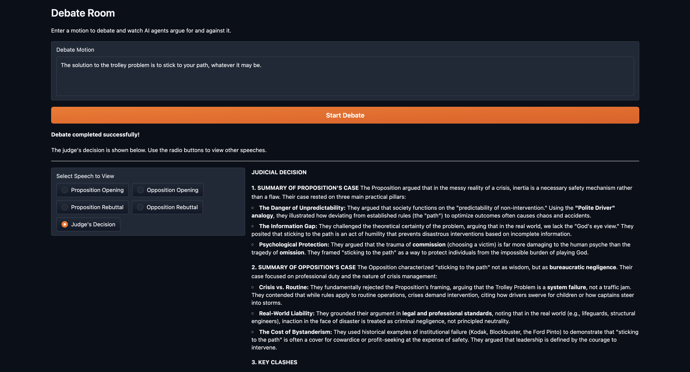

# Debate Room

Large language models generally tend to agree with given statements, making it difficult to obtain an unbiased answer to certain questions. To ascertain the truth of a point — or at least to understand the problem thoroughly — it is essential to gather arguments both for and against the proposition and then form a judgement based on those arguments. This tool facilitates that process effectively.

## Features

- **Formal Debate Structure**: Opening statements, rebuttals, and judicial verdict
- **Multi-Agent System**: Specialized debater and judge agents with distinct roles
- **Multiple Interfaces**:
  - CLI for direct execution
  - Gradio GUI for interactive web-based debates
- **Structured Output**: All arguments and decisions saved as markdown files
- **Asynchronous Opening Statements**: Both proposition and opposition openings generated in parallel
- **Comprehensive Rebuttals**: Each side responds to the other's arguments
- **Preference-Based Judging**: Judge declares winner with preference degree (low/medium/high/absolute)

## Quick Start

### Prerequisites

- Python >=3.10, <3.14
- [UV package manager](https://docs.astral.sh/uv/) (`pip install uv`)
- API keys (Google Gemini required, others optional)

### Installation

1. Clone the repository:
   ```bash
   git clone "https://github.com/salvani/debate-room.git"
   cd debate_room
   ```

2. Install dependencies:
   ```bash
   crewai install
   # or
   uv sync
   ```

3. Set up environment variables:
   ```bash
   cp .env.example .env
   # Edit .env with your API keys
   ```

   Required API keys:
   - `GOOGLE_API_KEY` or `GEMINI_API_KEY` - For Google Gemini LLM (required)
   - `OPENAI_API_KEY` - Optional, for OpenAI models
   - `ANTHROPIC_API_KEY` - Optional, for Claude models

### Running Debates

**Command Line:**
```bash
uv run debate_room
# or
crewai run
```

**GUI Mode:**
```bash
uv run debate_gui
```

The GUI provides a web interface where you can:
- Enter custom debate motions
- View real-time progress
- Browse all speeches and the judge's decision



## How It Works

The debate follows a formal structure with six sequential phases:

1. **Proposition Opening** (Task: `propose_opening`)
   - AI debater argues IN FAVOR of the motion
   - Output: `output/01_propose_opening.md`

2. **Opposition Opening** (Task: `oppose_opening`)
   - AI debater argues AGAINST the motion
   - Output: `output/02_oppose_opening.md`

3. **Openings Collection** (Task: `collect_openings`)
   - Both opening statements are gathered for review
   - Output: `output/03_openings_collected.md`

4. **Proposition Rebuttal** (Task: `propose_rebuttal`)
   - Proposition side responds to opposition arguments
   - Output: `output/04_propose_rebuttal.md`

5. **Opposition Rebuttal** (Task: `oppose_rebuttal`)
   - Opposition side responds to proposition arguments
   - Output: `output/05_oppose_rebuttal.md`

6. **Judge's Decision** (Task: `decide`)
   - AI judge evaluates all arguments and declares winner
   - Includes preference degree: low, medium, high, or absolute
   - Output: `output/06_decide.md`

## Project Structure

```
debate_room/
├── src/debate_room/
│   ├── crew.py              # CrewAI agent and task definitions
│   ├── main.py              # CLI entry point
│   ├── app.py               # Gradio GUI
│   ├── progress_tracker.py  # Real-time progress monitoring
│   └── config/
│       ├── agents.yaml      # Agent configurations (debater, judge)
│       └── tasks.yaml       # Task definitions (openings, rebuttals, decision)
├── docs/                    # Documentation assets
│   └── gui.png              # GUI screenshot
├── output/                  # Debate outputs (*.md files, git-ignored)
├── .env.example             # Environment variables template
├── pyproject.toml           # Project configuration
├── CLAUDE.md                # AI assistant guidance
└── README.md
```

## Configuration

### Agents (`src/debate_room/config/agents.yaml`)

- **debater**: A compelling debater who argues both for and against the motion
  - Role: Formal Debater
  - LLM: `gemini/gemini-3-pro-preview`

- **judge**: An impartial judge who evaluates arguments based on merit
  - Role: Debate Judge
  - LLM: `gemini/gemini-3-pro-preview`

### Tasks (`src/debate_room/config/tasks.yaml`)

Each task is automatically wired to the appropriate agent and executed in sequence.

### Changing the LLM Model

Edit the `MODEL` environment variable in `.env`:
```bash
MODEL=gemini/gemini-3-pro-preview  # Default
# Or use other models:
# MODEL=gpt-4
# MODEL=claude-3-5-sonnet-20241022
```

Update agent configurations in `config/agents.yaml` to use the new model.

## Customization

### Changing the Debate Motion

Edit `src/debate_room/main.py`:
```python
inputs = {
    'motion': 'Your custom motion here',
}
```

Or use the GUI to enter motions interactively.

### Adding New Agents

1. Define agent in `config/agents.yaml`
2. Add `@agent` method in `crew.py`:
   ```python
   @agent
   def your_agent(self) -> Agent:
       return Agent(config=self.agents_config['your_agent'], verbose=True)
   ```

### Adding New Tasks

1. Define task in `config/tasks.yaml`
2. Add `@task` method in `crew.py`:
   ```python
   @task
   def your_task(self) -> Task:
       return Task(config=self.tasks_config['your_task'])
   ```

Tasks execute in the order they're defined when using sequential process mode.

## Output Files

All debate outputs are saved in the `output/` directory:

| File | Content |
|------|---------|
| `01_propose_opening.md` | Proposition opening statement |
| `02_oppose_opening.md` | Opposition opening statement |
| `03_openings_collected.md` | Combined opening statements |
| `04_propose_rebuttal.md` | Proposition rebuttal |
| `05_oppose_rebuttal.md` | Opposition rebuttal |
| `06_decide.md` | Judge's final decision with preference rating |

## Technology Stack

- **CrewAI 1.7.0** - Multi-agent orchestration framework
- **Gradio 4.x** - Web-based GUI interface
- **UV** - Fast Python package manager
- **Google Gemini 3 Pro** - Default LLM for agents

## Why Crew (Not Flow)?

CrewAI offers two main abstractions: **Crews** and **Flows**.

| Aspect | Crew (used here) | Flow |
|--------|------------------|------|
| **Model** | Autonomous agents collaborating | Event-driven sequential/branching steps |
| **Control** | Agents decide how to collaborate | You define exact execution paths |
| **Best for** | Creative, emergent problem-solving | Predictable, auditable pipelines |

This project uses a **Crew** because:

1. **Debate is collaborative** - The debater and judge roles naturally fit the agent-based model
2. **Autonomy is desired** - We want the debater to craft creative arguments, not follow rigid templates
3. **Sequential process suffices** - `Process.sequential` enforces the correct order (openings -> rebuttals -> judgment)

A **Flow** would be preferable if you needed conditional branching (e.g., "if tie, run another round"), direct LLM calls without agent overhead, or integration into a larger production pipeline. The most powerful pattern is **Flows orchestrating Crews** for complex workflows requiring both creativity and precise control.

## Contributing

Contributions welcome! Please open an issue or submit a pull request.

## Support

- CrewAI [Documentation](https://docs.crewai.com)
- CrewAI [GitHub](https://github.com/joaomdmoura/crewai)
- CrewAI [Discord](https://discord.com/invite/X4JWnZnxPb)

## Acknowledgments

Built with [CrewAI](https://crewai.com) - A powerful framework for orchestrating role-playing, autonomous AI agents.
